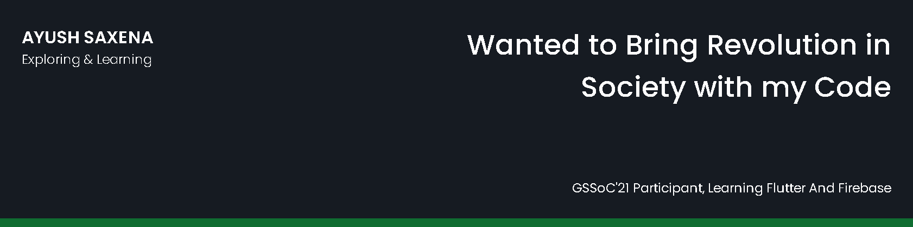

## 🧔 About Me

- 🔭 I’m currently working on my Google solution Challenge'21 Project (https://github.com/ayush78781/Educational_resources_ecommerce)

- 🌱 I’m currently learning **OS, COA, DSA, Flutter and Firebase**

- 👯 I’m looking to collaborate on **GSSoC'21 Flutter, Algorithmic Projects**

- 📝 Read my published article [https://www.geeksforgeeks.org/how-to-add-labels-in-a-plot-using-python/](https://www.geeksforgeeks.org/how-to-add-labels-in-a-plot-using-python/)

- 💬 Ask me about **C, C++, Python, DSA, Flutter and Firebase**

- 📫 Contact me **[here](ayush70781gmail.com)**

- 📄 My Resume [https://drive.google.com/file/d/1NKea2C2e7O1xkU9OzOOntUiTYmrjCMFi/view?usp=sharing](https://drive.google.com/file/d/1NKea2C2e7O1xkU9OzOOntUiTYmrjCMFi/view?usp=sharing)

## ✍ My Work

Here are some of my projects on Github that I am proud of:

## 📚 My Skills

## 🤝 Connect

